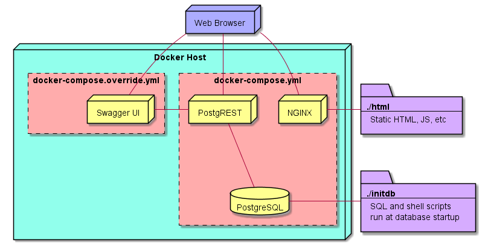

compose-postgrest
=================

[Postgres](https://www.postgresql.org/), [PostgREST](https://github.com/begriffs/postgrest), and [Swagger UI](https://github.com/swagger-api/swagger-ui) conveniently wrapped up with docker-compose.

Place SQL into the `initdb` folder, get REST! 
Includes [world sample database](https://www.postgresql.org/ftp/projects/pgFoundry/dbsamples/world/).

Contains a simple front-end  demo application.

Architecture
------------

Usage
-----

**Start the containers**

`docker-compose up -d`

**Tearing down the containers**

`docker-compose down --remove-orphans -v`

**Demo Application**

Located at [http://localhost](http://localhost)

**Postgrest**

Located at [http://localhost:3000](http://localhost:3000)

Try things like:
* [https://postgrest.org/en/stable/api.html](https://postgrest.org/en/stable/api.html)  
* [http://localhost:3000/location](http://localhost:3000/location)
* [http://localhost:3000/unit](http://localhost:3000/unit)
* [http://localhost:3000/location?long_name=eq.Норильск](http://localhost:3000/location?long_name=eq.Норильск)
* [http://localhost:3000/location?id=lte.5000&order=id](http://localhost:3000/location?id=lte.5000&order=id)
* [http://localhost:3000/location?long_name=like.*ское](http://localhost:3000/location?long_name=like.*ское)
* [http://localhost:3000/location?long_name=like.*ское5&id=lte.10000&select=id,name:long_name](http://localhost:3000/location?long_name=like.*ское&id=lte.10000&select=id,name:long_name)
* [http://localhost:3000/location?limit=15&offset=30](http://localhost:3000/location?limit=15&offset=30)

**Swagger UI**

Located at [http://localhost:8080](http://localhost:8080)
